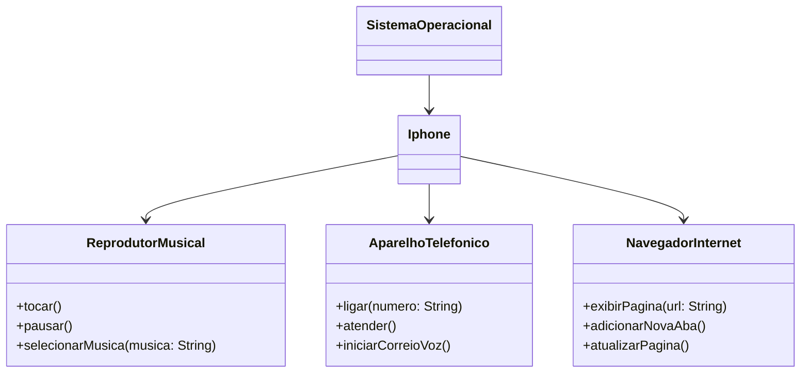

## Desafio Java Básico - Iphone

## Autores
- [Flávia Soares](https://github.com/Flaviasp1603)

Repositório criado para resolução de um Desafio DIO- Bootcamp Santander 2024 - Backend com Java, onde contempla a Modelagem e Diagramação em representação UML do componente iPhone, abrangendo suas funcionalidades como Reprodutor Musical, Aparelho Telefônico e Navegador na Internet.

## Ferramentas e tecnologias

 

## Diagrama UML

O diagrama UML foi criado utilizando a sintaxe [Mermaid](https://mermaid.js.org/), uma alternativa de código aberto e compatível com arquivos Markdown.

